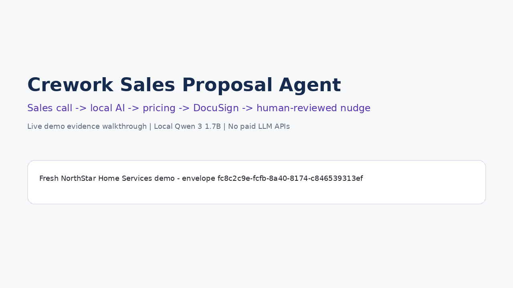
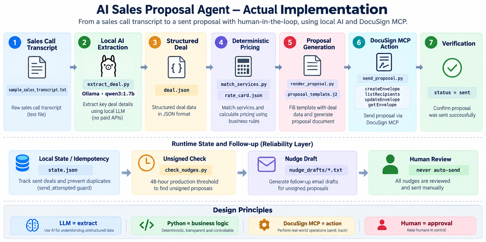

# 🤖 Crework Sales Proposal Agent

<p align="center">
  <strong>Sales Call → Local AI → Pricing → Proposal → DocuSign → Verification → Follow-up</strong>
</p>

<p align="center">
  A code-first AI workflow that turns an unstructured sales conversation into a priced proposal and a real DocuSign agreement — using a local Qwen model and no paid LLM API.
</p>

<p align="center">
  <a href="./Crework_Sales_Proposal_Agent_Final_Submission.pdf">📄 <strong>Read the full submission</strong></a>
  &nbsp;•&nbsp;
  <a href="./Crework_Sales_Proposal_Agent_Workflow.gif">🎬 <strong>Watch the demo</strong></a>
  &nbsp;•&nbsp;
  <a href="#-quick-start">⚡ <strong>Run it</strong></a>
</p>

<p align="center">
  
  
  
  
</p>

---

## ✨ What this project does

This project automates the operational work between a sales conversation and a proposal being sent for signature.

```text
┌────────────────────────┐
│ Sales Call Transcript  │
└───────────┬────────────┘
            ↓
┌────────────────────────┐
│ Local Qwen via Ollama  │  ← AI understanding
└───────────┬────────────┘
            ↓
┌────────────────────────┐
│ Structured deal.json   │
└───────────┬────────────┘
            ↓
┌────────────────────────┐
│ Rate-card matching     │  ← deterministic business logic
│ + price calculation    │
└───────────┬────────────┘
            ↓
┌────────────────────────┐
│ Proposal generation    │
└───────────┬────────────┘
            ↓
┌────────────────────────┐
│ DocuSign MCP           │  ← external action
│ create → populate      │
│ → validate → send      │
└───────────┬────────────┘
            ↓
┌────────────────────────┐
│ getEnvelope            │  ← verify actual status
└───────────┬────────────┘
            ↓
┌────────────────────────┐
│ Local state/idempotency│
└───────────┬────────────┘
            ↓
┌────────────────────────┐
│ Unsigned check         │
│ → nudge draft          │
│ → human review         │
└────────────────────────┘
```

> **Design principle:** The LLM understands the conversation. Python owns the business rules. DocuSign MCP performs the agreement action. A human approves follow-up communication.

---

## 🎬 See it first

<p align="center">
  
</p>

**The demonstrated result:**

| Output | Demonstrated value |
|---|---:|
| RAG Knowledge Assistant | $3,500 |
| AI Agent Development | $4,000 |
| **Total Proposal** | **$7,500** |
| DocuSign status | **Sent** |
| Follow-up | **Human-reviewed draft** |

📄 **[Open the full submission with screenshots and step-by-step evidence →](./Crework_Sales_Proposal_Agent_Final_Submission.pdf)**

---

## 🧭 Navigate the project

<details open>
<summary><strong>🎯 1. Why I built this</strong></summary>

### Business pain

After a sales call, someone often has to manually extract requirements, choose services, calculate pricing, prepare a proposal, create an agreement, send it, check its status, and follow up.

This project turns that sequence into one controlled workflow.

### Why this pairing works

**Local AI + deterministic code + DocuSign MCP** gives each component a clear responsibility:

- **Local Qwen** handles messy natural language.
- **Python** handles rules that should be predictable.
- **DocuSign MCP** handles the real agreement action.
- **Human review** stays in the communication loop.

</details>

<details>
<summary><strong>🧠 2. What the AI actually does</strong></summary>

The model is used for **information extraction**, not commercial decision-making.

It extracts fields such as:

```text
client_name
client_email
services_discussed
rough_scope
deliverables
timeline
```

The application then validates the required structure before moving to pricing.

**Important:** prices come from `rate_card.json`, not from the model.

</details>

<details>
<summary><strong>💰 3. How pricing works</strong></summary>

The local rate card currently contains:

```json
{
  "rag_system": 3500,
  "ai_agent": 4000
}
```

For the demonstrated deal:

```text
$3,500 + $4,000 = $7,500
```

This keeps commercial values deterministic and auditable.

</details>

<details>
<summary><strong>✍️ 4. What happens inside DocuSign MCP</strong></summary>

The send workflow is implemented in `send_proposal.py`:

```text
Idempotency check
      ↓
createEnvelope
      ↓
listRecipients
      ↓
Discover Client recipient
      ↓
Discover runtime text-tab IDs
      ↓
Populate fields
      ↓
Verify populated fields
      ↓
Record send_attempted
      ↓
Send envelope
      ↓
getEnvelope
      ↓
Confirm authoritative status
```

The demonstrated envelope was verified by `getEnvelope` as:

```text
status = sent
```

</details>

<details>
<summary><strong>🔁 5. How duplicate sends are prevented</strong></summary>

The workflow keeps local state keyed by a deterministic `deal_id`.

Before creating another envelope, `send_proposal.py` checks whether that deal already has a recorded send attempt.

This matters because an MCP interaction is not a replacement for application-level workflow state.

</details>

<details>
<summary><strong>⏰ 6. How follow-up works</strong></summary>

`check_nudges.py` checks sent envelopes and prepares a follow-up draft when a proposal remains unsigned beyond the configured threshold.

**Production threshold:** 48 hours.

For the demo, a temporary environment-variable override was used to demonstrate the behavior without waiting 48 hours. The override is removed after the demo.

The system writes a draft to:

```text
nudge_drafts/
```

It does **not** automatically send the email.

</details>

---

## 🏗️ Architecture

<p align="center">
  
</p>

### Map the architecture to the code

| Stage | File / component | Responsibility |
|---|---|---|
| Input | `sample_sales_transcript.txt` | Example sales call |
| AI extraction | `extract_deal.py` + Ollama | Turn conversation into structured data |
| Structured data | `deal.json` *(runtime)* | Store extracted deal |
| Pricing | `match_services.py` + `rate_card.json` | Match services and calculate fee |
| Proposal | `render_proposal.py` + `proposal_template.j2` | Render proposal content |
| DocuSign action | `send_proposal.py` + MCP client | Create, populate, validate and send |
| Verification | `getEnvelope` | Confirm actual envelope status |
| Reliability | `state.json` *(runtime)* | Idempotency / workflow memory |
| Follow-up | `check_nudges.py` | Detect unsigned proposals and draft a nudge |

---

## ⚡ Quick Start

### Prerequisites

- Python 3.11
- Ollama
- `qwen3:1.7b` available locally
- DocuSign developer/demo account
- A configured DocuSign MCP endpoint and OAuth token

### 1. Install dependencies

```powershell
pip install -r requirements.txt
```

### 2. Pull the local model

```powershell
ollama pull qwen3:1.7b
```

### 3. Configure secrets

Copy `.env.example` to `.env` and fill in your local DocuSign configuration.

> 🔒 **Never commit `.env`.** It is intentionally excluded by `.gitignore`.

### 4. Run the pipeline

```powershell
python extract_deal.py sample_sales_transcript.txt
python match_services.py
python render_proposal.py
python send_proposal.py
python check_nudges.py
```

---

## 🧪 Demo checkpoints

Run these commands to inspect each stage:

<details>
<summary><strong>Checkpoint A — extraction</strong></summary>

```powershell
python extract_deal.py sample_sales_transcript.txt
Get-Content .\deal.json
```

Expected: structured deal information containing the client, services, scope, deliverables and timeline.

</details>

<details>
<summary><strong>Checkpoint B — pricing</strong></summary>

```powershell
python match_services.py
Get-Content .\priced_deal.json
```

Expected: matched services and a deterministic total of **USD 7,500** for the demonstrated deal.

</details>

<details>
<summary><strong>Checkpoint C — proposal</strong></summary>

```powershell
python render_proposal.py
Get-Content .\generated_proposal.txt
```

Expected: a populated proposal containing scope, deliverables, timeline and fee.

</details>

<details>
<summary><strong>Checkpoint D — DocuSign</strong></summary>

```powershell
python send_proposal.py
```

Look for:

```text
TAB VERIFICATION: PASSED
AUTHORITATIVE STATUS (getEnvelope): sent
```

</details>

<details>
<summary><strong>Checkpoint E — nudge</strong></summary>

For demo-only execution:

```powershell
$env:DEMO_NUDGE_WINDOW_MINUTES="0"
python check_nudges.py
Remove-Item Env:DEMO_NUDGE_WINDOW_MINUTES
```

Expected: a local follow-up draft is created under `nudge_drafts/`.

</details>

---

## 📸 Evidence from the completed buildathon run

The repository includes a full submission PDF with the actual screenshots from the working run.

1. Sales transcript
2. Local Qwen extraction
3. Structured deal data
4. Deterministic pricing
5. Proposal generation
6. DocuSign envelope creation
7. Populated fields and validation
8. Sent status verification
9. Local state / idempotency
10. Human-reviewed nudge draft

👉 **[View the complete evidence package](./Crework_Sales_Proposal_Agent_Final_Submission.pdf)**

---

## 🛡️ Reliability & safety choices

| Risk | Design choice |
|---|---|
| LLM invents prices | Pricing is read from `rate_card.json` |
| Wrong recipient fields | Recipient/tab IDs are discovered dynamically |
| Sending bad values | Fields are verified before sending |
| Duplicate proposal | Local `deal_id` + send-attempt state |
| Assuming a send succeeded | `getEnvelope` verifies the authoritative status |
| Unapproved follow-up | Nudge is a draft, never auto-sent |
| Credential leakage | `.env` excluded from Git |

---

## 📁 Repository structure

```text
.
├── extract_deal.py
├── match_services.py
├── render_proposal.py
├── send_proposal.py
├── check_nudges.py
├── docusign_mcp_client.py
├── get_docusign_token.py
│
├── rate_card.json
├── proposal_template.j2
├── sample_sales_transcript.txt
├── requirements.txt
├── .env.example
├── .gitignore
│
├── architecture_actual.png
├── Crework_Sales_Proposal_Agent_Workflow.gif
└── Crework_Sales_Proposal_Agent_Final_Submission.pdf
```

Runtime artifacts such as `deal.json`, `priced_deal.json`, `state.json`, generated drafts, OAuth state and secrets are intentionally not part of the public source set.

---

## 🚀 What I would improve next

This is intentionally a small, code-first prototype. A production version could add:

- persistent database-backed workflow state
- stronger schema validation and rejection paths
- richer proposal document generation (DOCX/PDF)
- retry/backoff and dead-letter handling for external calls
- configurable approval policies and audit logs
- automated scheduled nudge execution with explicit human approval gates

---

## 💡 Other capability → business pain pairings

<details>
<summary><strong>1. DocuSign MCP + client onboarding</strong></summary>

Use agreement actions to reduce repetitive document setup during onboarding while keeping approval steps explicit.

</details>

<details>
<summary><strong>2. Stateless MCP + internal workflow state</strong></summary>

Keep durable state in the application while using MCP tools for external actions, reducing duplicate or repeated operations.

</details>

<details>
<summary><strong>3. Agreement status + follow-up workflow</strong></summary>

Query agreement status and prepare follow-up drafts so sales teams do not have to manually check every outstanding proposal.

</details>

---

## 🙌 Built for the Crework Labs buildathon

**Core stack:** Python · Ollama · Qwen 3 1.7B · DocuSign MCP · Jinja2 · JSON

**Key idea:** use AI where language understanding is valuable, and deterministic software where business correctness matters.

<p align="center">
  <a href="./Crework_Sales_Proposal_Agent_Final_Submission.pdf">📄 Submission</a>
  &nbsp;&nbsp;|&nbsp;&nbsp;
  <a href="./Crework_Sales_Proposal_Agent_Workflow.gif">🎬 Demo</a>
  &nbsp;&nbsp;|&nbsp;&nbsp;
  <a href="#-quick-start">⚡ Run locally</a>
</p>
