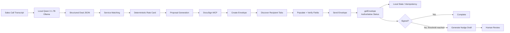

# 🤖 Crework Sales Proposal Agent

> **Sales call → structured deal → deterministic pricing → proposal → DocuSign → verified status → human-reviewed follow-up**

A **code-first AI Sales Proposal Agent** built for the Crework Labs buildathon.

It uses a **local Qwen 3 1.7B model through Ollama** for structured deal extraction, keeps commercial logic deterministic with a local rate card, and uses **DocuSign MCP** as the agreement action layer.

<p align="center">
  
  
  
  
</p>

---

## 🎯 The problem

After a sales call, someone may still need to:

**read the transcript → identify requirements → choose services → calculate pricing → prepare the proposal → create the agreement → populate fields → send it → check signature status → follow up**

This project turns those steps into one repeatable workflow.

---

## ✨ What the agent does

| Stage | What happens | Implementation |
|---|---|---|
| 📝 Understand | Extract client, services, scope, deliverables, timeline | Local Qwen via Ollama |
| 🧮 Price | Match services to fixed prices | Python + `rate_card.json` |
| 📄 Prepare | Build proposal content | `proposal_template.j2` |
| ✍️ Act | Create, populate and send agreement | DocuSign MCP |
| ✅ Verify | Confirm actual envelope status | `getEnvelope` |
| 🧠 Remember | Prevent duplicate sends | `state.json` |
| 🔔 Follow up | Prepare a nudge when unsigned | `check_nudges.py` |
| 👤 Approve | Human reviews the nudge before sending | Human-in-the-loop |

---

## 🏗️ Architecture



### 🖼️ Architecture at a glance

<p align="center">
  
</p>

### 🔑 Design principle

> **The LLM understands. Python decides. DocuSign acts. Humans approve external follow-up.**

The model is deliberately **not** responsible for pricing or sending decisions.

---

## 🔄 End-to-end workflow

```text
Transcript
   ↓
Local Qwen extraction
   ↓
deal.json
   ↓
Service matching
   ↓
Deterministic pricing
   ↓
Proposal generation
   ↓
DocuSign MCP
   ↓
Recipient/tab discovery
   ↓
Field population + validation
   ↓
Send
   ↓
Authoritative status verification
   ↓
State tracking / duplicate-send guard
   ↓
Unsigned-proposal check
   ↓
Human-reviewed nudge draft
```

---

## 💡 Why these choices?

### 🧠 Local LLM

**Ollama + `qwen3:1.7b`** handles only the natural-language extraction step.

That keeps the build **code-first and locally runnable**, without relying on a paid LLM API.

### 💰 Deterministic pricing

The model identifies **what services were discussed**.

Python decides **what those services cost** using `rate_card.json`.

For the demonstrated deal:

```text
RAG Knowledge Assistant    $3,500
AI Agent Development       $4,000
--------------------------------
Total                      $7,500
```

No LLM-generated price is accepted.

### 🔐 Idempotent sending

A stable `deal_id` is generated from the client name + normalized transcript hash.

Before a send, `state.json` is checked. A `send_attempted` marker is recorded **before the external send**, so an ambiguous failure does not silently trigger a second envelope.

### 👤 Human-in-the-loop follow-up

The system does **not** automatically email a customer.

When an unsigned proposal reaches the configured threshold, it writes a local nudge draft for a human to review.

---

## 🚀 Quick start

### 1. Clone

```bash
git clone https://github.com/Aryan-0708/crework-ai-sales-proposal-agent.git
cd crework-ai-sales-proposal-agent
```

### 2. Create the environment

```powershell
python -m venv .venv
.\.venv\Scripts\Activate.ps1
pip install -r requirements.txt
```

### 3. Install the local model

```powershell
ollama pull qwen3:1.7b
```

### 4. Configure DocuSign

Create the required local `.env` values using `.env.example`.

Then authenticate:

```powershell
python get_docusign_token.py
```

> **Important:** `.env`, runtime state, recipient data and temporary request files are intentionally excluded from Git.

---

## ▶️ Run the pipeline

### Step 1 — Extract deal information

```powershell
python extract_deal.py sample_sales_transcript.txt
```

Creates a runtime `deal.json` with fields such as:

```json
{
  "deal_id": "...",
  "client_name": "NorthStar Home Services",
  "client_email": "",
  "services_discussed": [],
  "rough_scope": "...",
  "deliverables": [],
  "timeline": "..."
}
```

### Step 2 — Match services + price

```powershell
python match_services.py
```

Creates runtime `priced_deal.json`.

### Step 3 — Render proposal

```powershell
python render_proposal.py
```

Creates a local proposal preview.

### Step 4 — Create + populate + send DocuSign envelope

```powershell
python send_proposal.py
```

The script:

1. Checks idempotency state.
2. Creates a draft envelope from the reusable DocuSign template.
3. Discovers the `Client` recipient.
4. Discovers that envelope's runtime tab IDs.
5. Populates the six proposal fields.
6. Verifies the populated values.
7. Records `send_attempted`.
8. Sends the envelope.
9. Calls `getEnvelope` to verify the authoritative status.

### Step 5 — Check unsigned proposals

```powershell
python check_nudges.py
```

Production behavior uses a **48-hour unsigned threshold**.

For demos, the threshold can be temporarily overridden with `DEMO_NUDGE_WINDOW_MINUTES`; the override is removed afterwards.

---

## 🧪 Demo result

The demonstrated run produced:

```text
Client:        NorthStar Home Services
Services:      RAG Knowledge Assistant + AI Agent Development
Timeline:      4–6 weeks
Total Fee:     USD 7,500
DocuSign:      Envelope created + sent
Verification:  getEnvelope → sent
Follow-up:     Human-reviewed nudge draft
```

### Demo envelope

```text
Envelope ID: fc8c2c9e-fcfb-8a40-8174-c846539313ef
Status:      sent
```

> The envelope ID above is from the recorded demo run. For a fresh run, DocuSign generates a new ID.

---

## 📸 Demo evidence

The buildathon submission includes visual evidence for the full workflow:

- Architecture diagram
- Transcript input
- Local Qwen extraction
- Structured deal data
- Deterministic pricing
- Generated proposal
- DocuSign envelope + recipient
- Populated proposal fields
- Signature/date fields
- Sent status
- State/idempotency evidence
- Nudge draft
- End-to-end workflow GIF

See the final submission package for the complete walkthrough.

---

## 📁 Project structure

```text
crework-ai-sales-proposal-agent/
│
├── extract_deal.py           # Local LLM structured extraction
├── match_services.py         # Deterministic service → price matching
├── render_proposal.py        # Proposal rendering
├── send_proposal.py          # DocuSign MCP orchestration
├── check_nudges.py           # Unsigned proposal follow-up drafts
│
├── docusign_mcp_client.py    # Reusable MCP client wrapper
├── get_docusign_token.py     # OAuth/token helper
│
├── rate_card.json            # Deterministic service pricing
├── proposal_template.j2      # Proposal template
├── sample_sales_transcript.txt
│
├── requirements.txt
├── .env.example
├── .gitignore
└── README.md
```

### Runtime-only files

These are intentionally generated locally and excluded from the repository:

```text
deal.json
priced_deal.json
state.json
generated_proposal.txt
demo_sales_transcript.txt
nudge_drafts/
*_args.json
.env
```

---

## 🧩 DocuSign MCP implementation notes

The workflow discovered a few practical MCP constraints during implementation:

- The reusable DocuSign template was configured manually in the DocuSign console.
- The implemented MCP path uses classic recipient Text tabs assigned to the `Client` role.
- Recipient tab IDs are **per-envelope**, so they are rediscovered after each new envelope is created.
- Some MCP parameters need string values such as `"true"` for `include_tabs`.
- The application verifies the final envelope state with `getEnvelope` instead of relying only on the send call response.

These constraints shaped the implementation rather than being hidden from the design.

---

## 🛡️ Safety + reliability

| Concern | Handling |
|---|---|
| Secrets | `.env` ignored; `.env.example` committed |
| Pricing hallucination | LLM never determines price |
| Missing email | Send is blocked rather than guessed |
| Duplicate sends | `state.json` + `deal_id` + `send_attempted` |
| Ambiguous send result | Verify with `getEnvelope` |
| Automatic customer follow-up | Not implemented; draft only |
| Runtime/demo data | Generated locally and excluded from Git |

---

## ⚠️ Known limitations

This is a buildathon prototype, not a production deployment.

- Local JSON is used for state instead of a production database.
- The DocuSign template is configured manually once.
- The recipient email must be supplied when it is absent from the transcript.
- Nudge delivery is intentionally human-approved.
- The local 1.7B model is optimized for the constrained extraction task rather than broad autonomous reasoning.

---

## 🔭 Natural next steps

A production version could add:

- Persistent database-backed workflow state
- CRM integration
- Automatic transcript ingestion from a meeting platform
- Stronger schema validation / confidence checks
- Multiple currencies and pricing rules
- Role-based approval workflows
- Email/CRM follow-up integrations
- Observability, retries and audit logging

---

## 💭 Other capability → pain ideas explored

### DocuSign MCP + client onboarding
Create and manage onboarding agreements as part of a repeatable onboarding workflow.

### Stateless MCP + internal tool lookup
Use MCP for external actions while the application owns state, rate limits and duplicate-action protection.

### Agreement status + automated follow-up
Use agreement status to identify unsigned proposals and prepare follow-up actions for human review.

### Meta Muse + WhatsApp DM response
Explore how a new multimodal/social capability could support customer communication workflows.

---

## 👤 Author

**Aryan Jagtap**

Built as a **Crework Labs buildathon project**.

[GitHub Repository](https://github.com/Aryan-0708/crework-ai-sales-proposal-agent)

---

## ⭐ If you're reviewing this project

The core idea is intentionally simple:

> **Use AI where language is messy. Use deterministic code where correctness matters. Use MCP where an external business action must happen. Keep a human in control of the final communication.**
